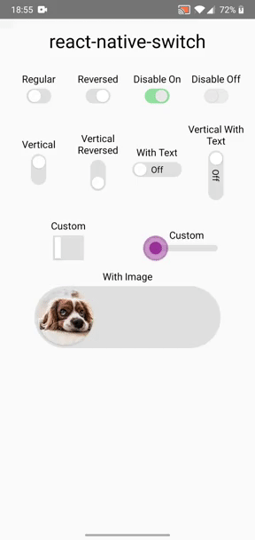

# react-native-switch

A simple and fully customizable React Native component that implements a switch (toggle) for android and ios, that also support in RTL.

Example One
:-------------------------:
 [example/App.js](example/App.js)